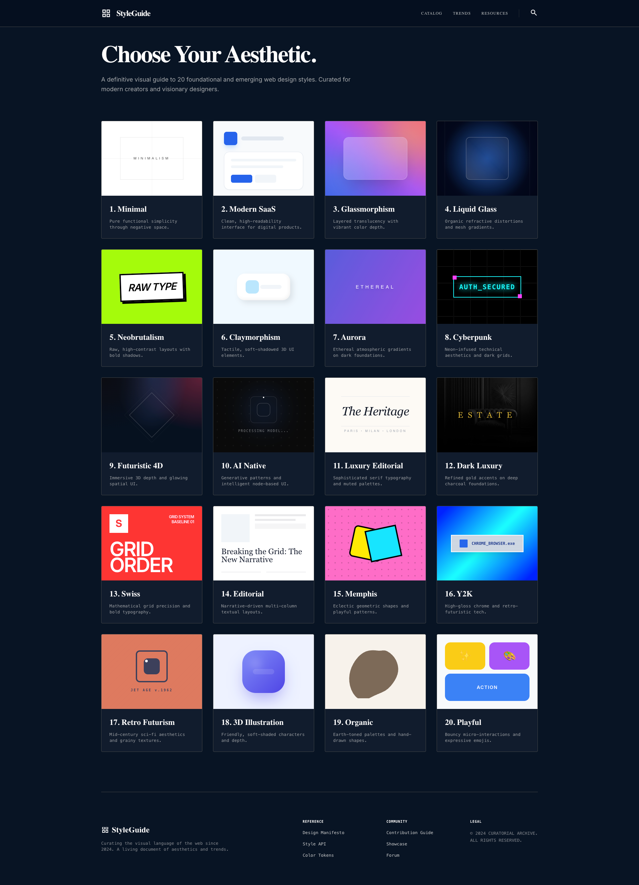

# Web Style Guide

A definitive visual guide to 20 foundational and emerging web design styles. Curated for modern creators and visionary designers.

## Live Demo
🚀 **[https://web-style-guide.web.app](https://web-style-guide.web.app)**

## Preview

## Styles Included
The guide contains interactive demos for the following aesthetics:

1. Minimal
2. Modern SaaS
3. Glassmorphism
4. Liquid Glass
5. Neobrutalism
6. Claymorphism
7. Aurora
8. Cyberpunk
9. Futuristic 4D
10. AI Native
11. Luxury Editorial
12. Dark Luxury
13. Swiss
14. Editorial
15. Memphis
16. Y2K
17. Retro Futurism
18. 3D Illustration
19. Organic
20. Playful
